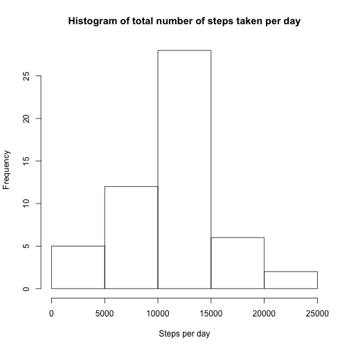
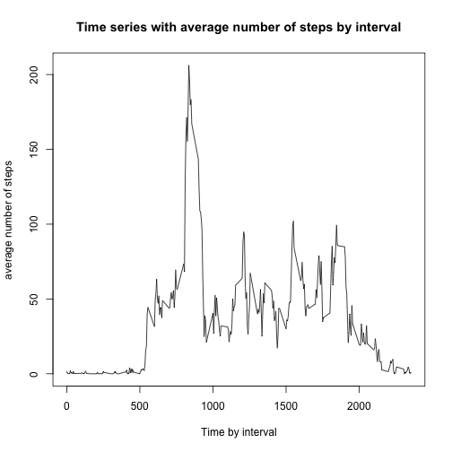
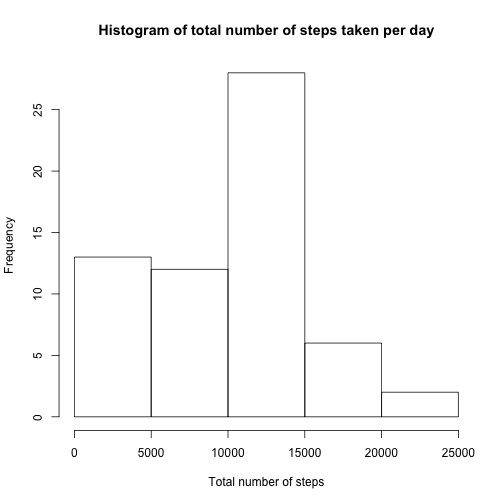
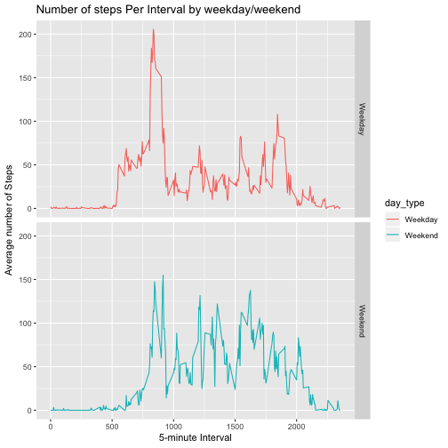

## Introduction

It is now possible to collect a large amount of data about personal movement using activity monitoring devices such as a Fitbit, Nike Fuelband, or Jawbone Up. These type of devices are part of the ???quantified self??? movement ??? a group of enthusiasts who take measurements about themselves regularly to improve their health, to find patterns in their behavior, or because they are tech geeks. But these data remain under-utilized both because the raw data are hard to obtain and there is a lack of statistical methods and software for processing and interpreting the data.

This assignment makes use of data from a personal activity monitoring device. This device collects data at 5 minute intervals through out the day. The data consists of two months of data from an anonymous individual collected during the months of October and November, 2012 and include the number of steps taken in 5 minute intervals each day.

The data for this assignment can be downloaded from the course web site:

Dataset: Activity monitoring data 
The variables included in this dataset are:

**step**: Number of steps taking in a 5-minute interval (missing values are coded as **NA**)
**date**: The date on which the measurement was taken in YYYY-MM-DD format
**interval**: Identifier for the 5-minute interval in which measurement was taken
The dataset is stored in a comma-separated-value (CSV) file and there are a total of 17,568 observations in this dataset.

##Review Criteria
####Repo

Valid GitHub URL
At least one commit beyond the original fork
Valid SHA-1
SHA-1 corresponds to a specific commit


####Commit containing full submission

Code for reading in the dataset and/or processing the data
Histogram of the total number of steps taken each day
Mean and median number of steps taken each day
Time series plot of the average number of steps taken
The 5-minute interval that, on average, contains the maximum number of steps
Code to describe and show a strategy for imputing missing data
Histogram of the total number of steps taken each day after missing values are imputed
Panel plot comparing the average number of steps taken per 5-minute interval across weekdays and weekends
All of the R code needed to reproduce the results (numbers, plots, etc.) in the report

##Assignment

###Loading and preprocessing the data

####1.Load the Data
####2.Process/transform the data (if necessary) into a format suitable for your analysis


```r
activity <- read.csv('activity.csv',as.is = TRUE)
dim(activity)
```

```
## [1] 17568     3
```

```r
##17568 rows, 3 columns
```


```r
#head, 5 rows, of dataset
head(activity,5)
```

```
##   steps       date interval
## 1    NA 2012-10-01        0
## 2    NA 2012-10-01        5
## 3    NA 2012-10-01       10
## 4    NA 2012-10-01       15
## 5    NA 2012-10-01       20
```

```r
##tail, 5 rows, of dataset
tail(activity,5)
```

```
##       steps       date interval
## 17564    NA 2012-11-30     2335
## 17565    NA 2012-11-30     2340
## 17566    NA 2012-11-30     2345
## 17567    NA 2012-11-30     2350
## 17568    NA 2012-11-30     2355
```


```r
##total missing values
complete_act <- activity[complete.cases(activity),]
dim(complete_act)
```

```
## [1] 15264     3
```

```r
## 15264 complete values
```


###What is mean total number of steps taken per day?

####1. Calculate the total number of steps taken per day

```r
##total number of steps taken per day
total_steps <- aggregate(steps ~ date, complete_act, sum)
head(total_steps)
```

```
##         date steps
## 1 2012-10-02   126
## 2 2012-10-03 11352
## 3 2012-10-04 12116
## 4 2012-10-05 13294
## 5 2012-10-06 15420
## 6 2012-10-07 11015
```

####2. If you do not understand the difference between a histogram and a barplot, research the difference between them. Make a histogram of the total number of steps taken each day

```r
## histogram
hist(total_steps$steps, main = "Histogram of total number of steps taken per day", xlab = "Steps per day")
```



####3. Calculate and report the mean and median of the total number of steps taken per day

```r
## summary of total steps with mean and median
summary(total_steps)
```

```
##      date               steps      
##  Length:53          Min.   :   41  
##  Class :character   1st Qu.: 8841  
##  Mode  :character   Median :10765  
##                     Mean   :10766  
##                     3rd Qu.:13294  
##                     Max.   :21194
```


### What is the average daily activity pattern?

####1. Make a time series plot (i.e. type = "l") of the 5-minute interval (x-axis) and the average number of steps taken, averaged across all days (y-axis)

```r
## time series plot 
average_steps <- aggregate(steps ~ interval, complete_act,mean) 
plot(average_steps$interval,average_steps$steps,type = 'l',col=1,main = 'Time series with average number of steps by interval',xlab='Time by interval',ylab = 'average number of steps')
```




####2. Which 5-minute interval, on average across all the days in the dataset, contains the maximum number of steps?

```r
## maximum time interval
interval_max <- which.max(average_steps$steps)
print (paste('The interval with the highest average steps is ', average_steps[interval_max, ]$interval))
```

```
## [1] "The interval with the highest average steps is  835"
```

```r
## number of steps of interval
print (paste('Number of steps for that interval is ', average_steps[interval_max, ]$steps))
```

```
## [1] "Number of steps for that interval is  206.169811320755"
```
###Imputing missing values

####1. Calculate and report the total number of missing values in the dataset (i.e. the total number of rows with NAs)

```r
##total missing values
missing_act <- activity[is.na(activity$steps),]
dim(missing_act)
```

```
## [1] 2304    3
```

```r
## 2304 missing values
```

####2. Devise a strategy for filling in all of the missing values in the dataset. The strategy does not need to be sophisticated. For example, you could use the mean/median for that day, or the mean for that 5-minute interval, etc.

```r
##median steps fill
median_steps <- with(complete_act, tapply(steps, complete_act$interval, median))
missing_act$steps <- median_steps
head(missing_act)
```

```
##   steps       date interval
## 1     0 2012-10-01        0
## 2     0 2012-10-01        5
## 3     0 2012-10-01       10
## 4     0 2012-10-01       15
## 5     0 2012-10-01       20
## 6     0 2012-10-01       25
```

```r
tail(missing_act)
```

```
##       steps       date interval
## 17563     0 2012-11-30     2330
## 17564     0 2012-11-30     2335
## 17565     0 2012-11-30     2340
## 17566     0 2012-11-30     2345
## 17567     0 2012-11-30     2350
## 17568     0 2012-11-30     2355
```


####3. Create a new dataset that is equal to the original dataset but with the missing data filled in.

```r
##new data set with values filled
new_activity <- rbind(complete_act, missing_act)
dim(new_activity)
```

```
## [1] 17568     3
```


```r
##check if new data set has NA values
print(new_activity[is.na(new_activity$steps),])
```

```
## [1] steps    date     interval
## <0 rows> (or 0-length row.names)
```


####4. Make a histogram of the total number of steps taken each day and Calculate and report the mean and median total number of steps taken per day. Do these values differ from the estimates from the first part of the assignment? What is the impact of imputing missing data on the estimates of the total daily number of steps?


```r
##Histogram
total_steps2 <- with(new_activity, tapply(steps, as.factor(new_activity$date), sum))
hist(total_steps2, main = "Histogram of total number of steps taken per day", xlab = "Total number of steps")
```



```r
## summary of total steps with mean and median
summary(total_steps)
```

```
##      date               steps      
##  Length:53          Min.   :   41  
##  Class :character   1st Qu.: 8841  
##  Mode  :character   Median :10765  
##                     Mean   :10766  
##                     3rd Qu.:13294  
##                     Max.   :21194
```
First dataset compared with the new filled data set

```r
## summary of total steps with mean and median with filled data
summary(total_steps2)
```

```
##    Min. 1st Qu.  Median    Mean 3rd Qu.    Max. 
##      41    6778   10395    9504   12811   21194
```


###Are there differences in activity patterns between weekdays and weekends?

####1. Create a new factor variable in the dataset with two levels ??? ???weekday??? and ???weekend??? indicating whether a given date is a weekday or weekend day.


```r
## function to verify if it is a weekday or a weekend
week_day <- function(day_var) {
    wds <- weekdays(as.Date(day_var, '%Y-%m-%d'))
    if  (!(wds == 'Saturday' || wds == 'Sunday')) {
        x <- 'Weekday'
    } else {
        x <- 'Weekend'
    }
    x
}
```


```r
## use the function to create new variable
new_activity$day_type <- as.factor(sapply(new_activity$date,week_day))
```
####2. Make a panel plot containing a time series plot (i.e. **type = "l"**) of the 5-minute interval (x-axis) and the average number of steps taken, averaged across all weekday days or weekend days (y-axis). See the README file in the GitHub repository to see an example of what this plot should look like using simulated data.


```r
##ggplot
library(ggplot2)

steps_Day <- aggregate(steps ~ interval + day_type, new_activity, mean)
```


```r
##create plot
plt <- ggplot(steps_Day, aes(interval, steps)) +
    geom_line(stat = "identity", aes(colour = day_type)) +
    theme_gray() +
    facet_grid(day_type ~ ., scales="fixed", space="fixed") +
    labs(x="5-minute Interval", y=expression("Average number of Steps")) +
    ggtitle("Number of steps Per Interval by weekday/weekend")
print(plt)
```




##Conclusions
I can see a minor difference between the weekdays and the weekends, people tend to wlk a little bit more in weekends and as we can see they start to walk later.
